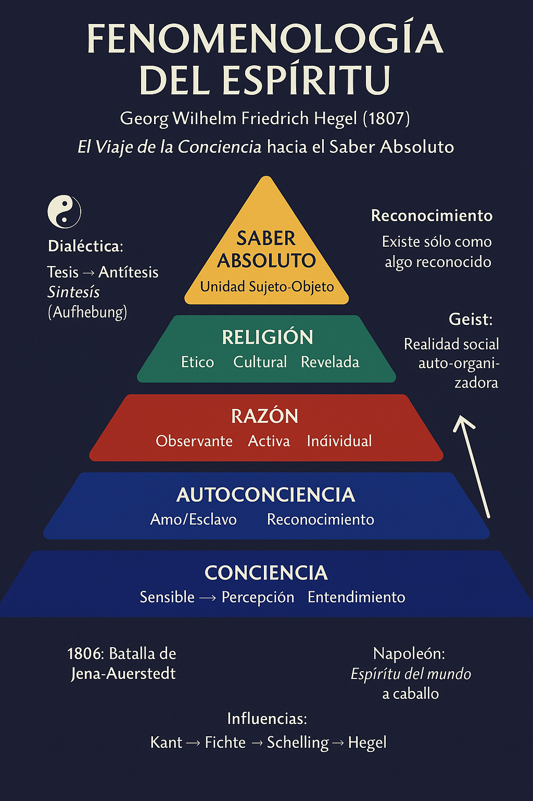

# Infografía: Fenomenología del Espíritu - Documentación

## 📋 Información General

**Archivo**: `infografia-fenomenologia-esquema.png`  
**Ubicación**: `/workspace/hegel/images/`  
**Dimensiones**: 1024 x 1536 px  
**Formato**: PNG (2.18 MB)  
**Propósito**: Representación esquemática académica de la estructura conceptual de la "Fenomenología del Espíritu" de Hegel

## 🎯 Especificaciones Cumplidas

### Estructura Visual
- ✅ **Formato**: Infografía vertical estilo piramidal/escalera
- ✅ **Orientación**: Vertical, lectura de arriba abajo
- ✅ **Estilo**: Académico moderno, profesional, educativo
- ✅ **Compatibilidad**: Web-ready, mobile-friendly

### Contenido Académico
- ✅ **Estructura de 6 niveles** (orden correcto):
  1. **CONCIENCIA** (base): Sensible → Percepción → Entendimiento
  2. **AUTOCONCIENCIA**: Amo/Esclavo → Reconocimiento
  3. **RAZÓN**: Observante → Activa → Individual
  4. **ESPÍRITU**: Ético → Cultural → Moral
  5. **RELIGIÓN**: Natural → Artística → Revelada
  6. **SABER ABSOLUTO** (cima): Unidad Sujeto-Objeto

- ✅ **Conceptos clave laterales**:
  - Dialéctica: Tesis → Antítesis → Síntesis (Aufhebung)
  - Reconocimiento: "Existe sólo como algo reconocido"
  - Geist: Realidad social auto-organizadora

- ✅ **Contexto histórico**:
  - 1806: Batalla de Jena-Auerstedt
  - Napoleón: "Espíritu del mundo a caballo"
  - Influencias: Kant → Fichte → Schelling → Hegel

### Diseño Visual
- ✅ **Esquema de colores académicos**:
  - Azul profundo (#1e3a8a): Conciencia, Espíritu
  - Rojo intenso (#dc2626): Razón
  - Verde esmeralda (#059669): Religión
  - Dorado (#d97706): Saber Absoluto
  - Grises: Texto, estructura

- ✅ **Elementos gráficos**:
  - Flecha ascendente indicando progresión
  - Símbolo yin-yang para dialéctica
  - Estructura piramidal clara
  - Tipografía legible y jerárquica

## 🔗 Integración Web

### Uso Recomendado
```html

```

### SEO y Accesibilidad
**Alt Text**: "Infografía esquemática: Fenomenología del Espíritu de Hegel - Los 6 niveles del desarrollo de la conciencia desde la certeza sensible hasta el saber absoluto"

**Descripción**: Representación visual académica de la estructura conceptual de la obra fundamental de Hegel, mostrando el progreso dialéctico de la conciencia a través de sus seis etapas principales.

## 📚 Fuentes Académicas

La infografía se basa en la investigación académica exhaustiva disponible en:
- `docs/fenomenologia_hegel_analisis_academico.md` (12,000+ palabras)
- `docs/sintesis_final_fenomenologia_web.md`
- `data/hegel_scholar_papers.json` (285 papers académicos)

## 🎓 Valor Pedagógico

### Audiencia Objetivo
- Estudiantes de filosofía (undergraduate/graduate)
- Investigadores en idealismo alemán
- Profesores de historia de la filosofía
- Público académico interesado en Hegel

### Casos de Uso
1. **Material didáctico**: Complemento visual para clases
2. **Referencia rápida**: Esquema de la estructura de la obra
3. **Contenido web**: Elemento visual para la página académica
4. **Presentaciones**: Material para conferencias académicas
5. **Publicación**: Ilustración para papers o libros

## ✨ Características Técnicas

- **Resolución**: Alta calidad (adecuada para impresión)
- **Peso optimizado**: 2.18 MB (balance calidad/velocidad web)
- **Formato universal**: PNG compatible con todos los navegadores
- **Responsive**: Escalable para diferentes dispositivos
- **Profesional**: Adecuada para contextos académicos formales

---

*Creada el 7 de junio de 2025 como parte del proyecto académico sobre la Fenomenología del Espíritu de Hegel*
